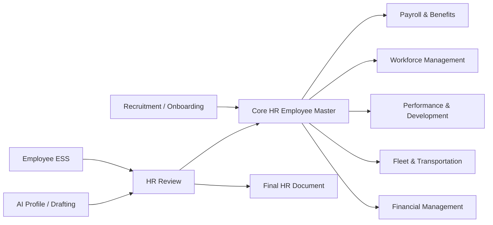
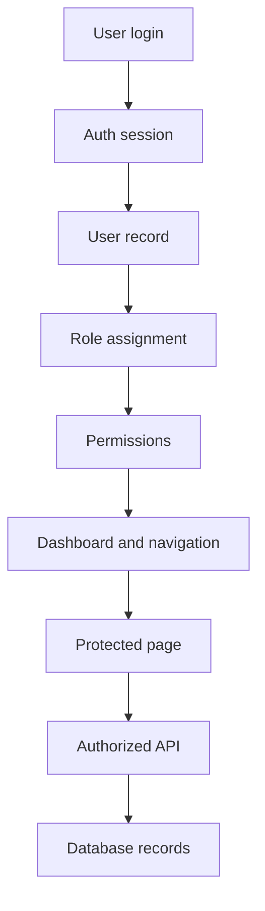

# Core HR System Workflow and RBAC

## 1. Core ownership boundaries

### Group 4 — Core HR (this project)
Core HR is the source of truth for:
- employee master data
- employment history and status
- departments, positions, and branches
- employee records
- ESS and change requests
- employee documents
- HR AI profiling and document drafting

Other modules remain authoritative for their own operational data and only consume references from Core HR such as `employee_id`, `department_id`, `position_id`, and `branch_id`.

## 2. Cross-module data flow

## 3. Data handoff rules

### New hire
Recruitment -> Onboarding -> Core HR employee creation -> `employee_id` generated -> other modules reference employee_id.

### Employee change
Employee -> ESS change request -> HR review -> Core HR update -> audit log -> notification.

### Payroll
Core HR provides employee identity and organizational reference. Payroll remains authoritative for salary and benefit transactions.

### Workforce
Core HR provides employee reference; Workforce owns attendance and leave records.

### Performance
Core HR provides employee reference and org info; Performance owns training and performance records.

### Fleet
Core HR provides employee reference; Fleet owns driver and trip records.

### Financial
Core HR provides employee reference; Financial owns transactions and accounting data.

## 4. RBAC model

The system uses database-backed roles and permissions. The base role structure is:

- ADMIN
- HR
- EMPLOYEE
- MANAGER
- SYSTEM_INTEGRATION

The permission model is enforced server-side and is backed by the `roles`, `permissions`, and `role_permissions` tables. User-to-role assignment is tracked in `user_roles`.

## 5. Authentication and UI flow

## 6. Integration contract summary

Core HR exposes read-only integration endpoints for other modules with a minimal safe payload:

- `GET /api/integration/employees/{id}`
- `GET /api/integration/employees/{id}/employment`
- `GET /api/integration/employees/{id}/status`
- `GET /api/integration/departments/{id}`
- `GET /api/integration/positions/{id}`
- `GET /api/integration/branches/{id}`

These endpoints require authenticated HR/Admin access and never expose password hashes, session tokens, or unnecessary personal data.

## 7. Security expectation

- UI visibility is not access control.
- server-side checks always govern access.
- employees can only access their own data.
- unauthorized URL or API usage returns `403`.
- direct ID tampering is rejected by server-side ownership validation.

## 8. Implementation notes

The existing Core HR app preserves the authoritative `employees` table and does not duplicate master data into external modules. Phase 5 adds a permission-backed access-control layer and keeps the data-exchange contract read-only and integration-safe.
